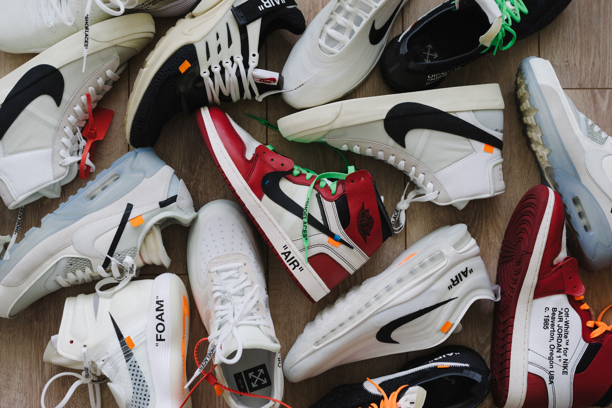
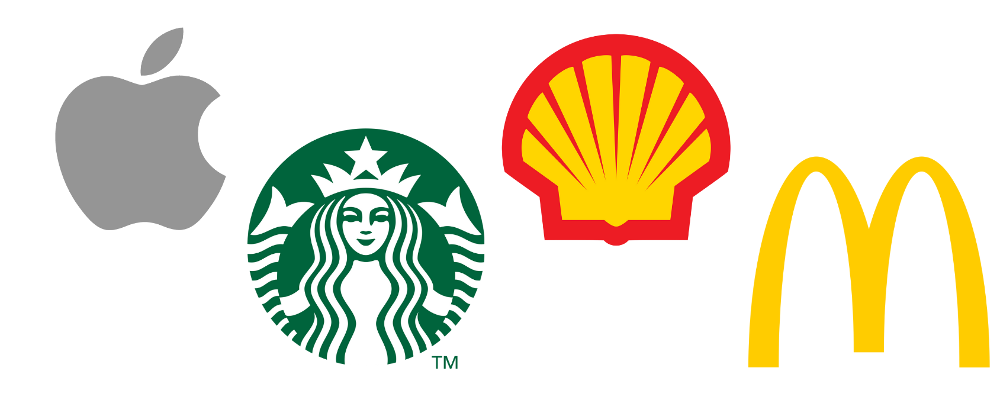
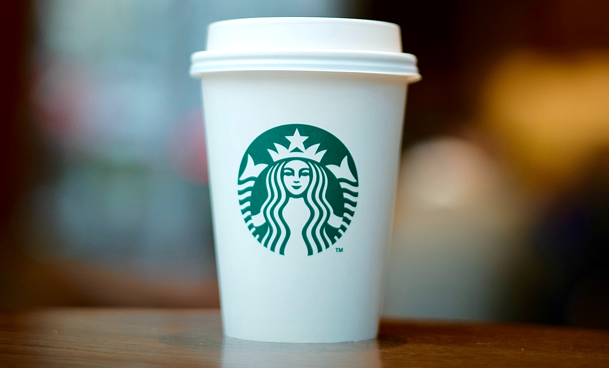

Has modern branding moved past the need for type in logos? In an attempt to be more personable with evermore jaded consumers, companies are getting rid of the words in their symbols. But does it actually work?

Swoosh. Tick. Check. You know the brand instantly. Nike’s infamous logo, on the side of nearly every other hoodie or pair of shoes you see on the pavement. Even in the doorway to my house I’m met with at least a dozen Swooshes on the shoe rack.

The Swoosh doesn’t necessarily make the Nike title redundant. Since the late 1970s, Nike has been using the Futura Condensed Extra Black font, created by Paul Renner. The bold typeface and use of all capital letters is effective in illustrating the strong public image of the brand; and the slight italicising of the letters showcases Nike’s lean and sporty persona. While the Nike typography can be seen on a lot of the company’s apparel, it was officially removed from the logo in 1995, effectively suggesting that the Swoosh (representative of both speed and the Greek Goddess Nike’s wings) is more integral to the Nike brand than the name itself.

Nike isn’t the only company to put more importance on their graphic emblem than house typeface. At the end of 2018, Mastercard unveiled the latest update to their logo: the complete and utter absence of the word "Mastercard" altogether. And it's actually more common than you might even realise. Think of Apple. Starbucks. Shell. Even McDonald's is represented by the classic golden arches, with no "cDonald's" to follow. A truly specific kind of Mandela effect where we can picture the name of the company emblazoned across their emblem, but a quick image search proves us wrong in seconds.

Has debranding gone too far? Are we really more receptive to just shapes and colours than words and fonts? Surely not. We learn to read for a reason, we learn in primary school that **bold** is **loud**, that CAPITAL LETTERS are for IMPORTANT THINGS. The idea that a wordless logo evokes a more personal response (according to Jill J. Avery of Harvard Business School) is maybe to do with our modern tendencies to scroll through image after image online, only holding our thumbs down and double tapping on the brightest or prettiest things that grab our ever shrinking attention spans (and yes, I am guilty of this too, so I'm not casting stones). But the Swoosh without Nike is simply a tick; what does a green mermaid have to do with coffee? Fonts and type styles are carefully chosen by designers for a reason, just as authors construct beautiful sentences, to evoke what a supporting image is meant to emphasise, not overtake.

