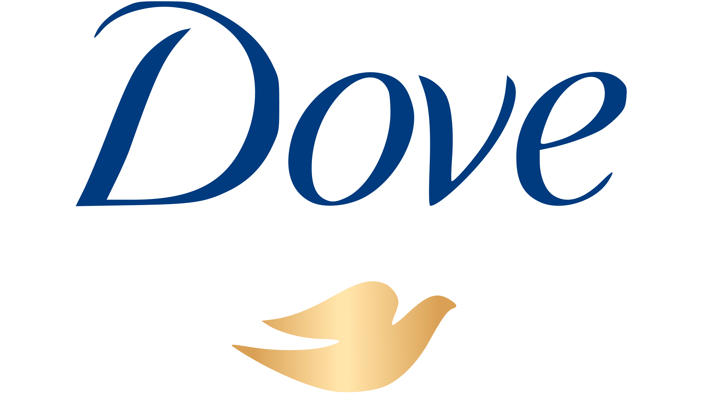
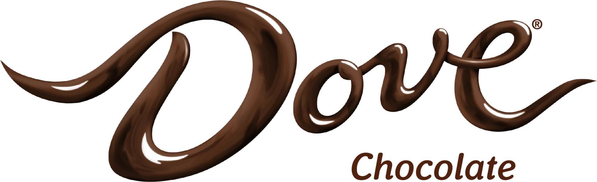
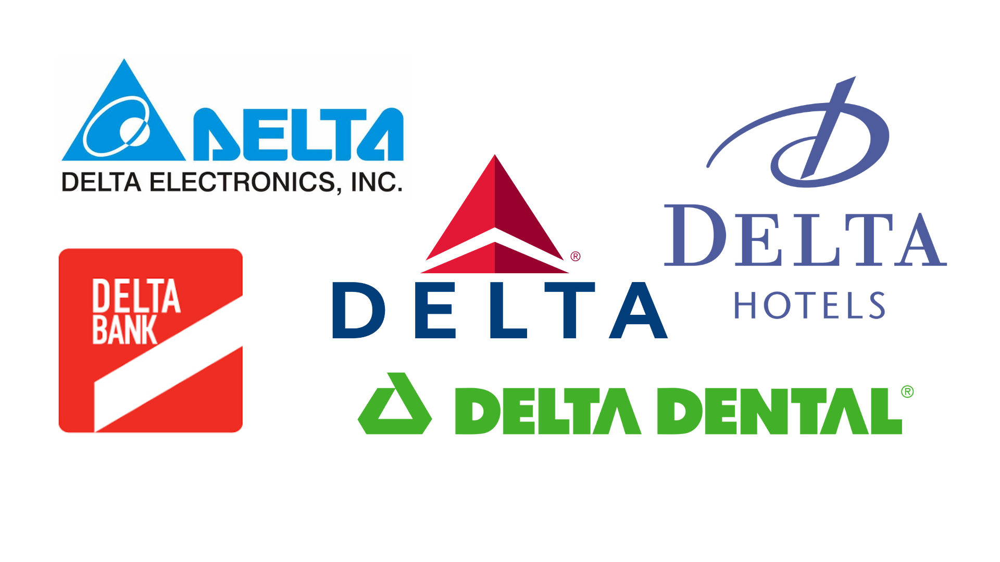

Ask a Brit what Dove is and they'll tell you it's a skin company, their grandma probably has a soap bar by the sink, mum's got the lotion and being passed around the changing is an aerosol deodorant with a familiar gold dove gleaming on the side. Ask an American and they'll tell you it's melt-in-your-mouth chocolate (basically the American equivalent of a UK Galaxy bar) that is perfect for hiding from your family until you fancy a treat. Same name. Different products. So what makes these two different enough that no confused tourists on either side of the pond are going to mix them up? Typography. The same word, just different designs. 'Brand twins' are often able to effectively coexist because of this.

The personal care company Dove uses a blue type; the colour is often associated with skin and cleanliness products (think Carex, Nivea and so on), already creating mental connotations that have absolutely nothing to do with chocolate and everything to do with clarity. The soft edges of the serif font help show the tenderness of the products they sell, while the soft flicks on the end of each line creates a feel of elegance. Overall, this is not the look of a product that you're going to dunk in your tea or snack away on at midnight to help you sleep. 

The Dove chocolate logo looks just as elegant in a similarly curved font, implying it's a luxury treat compared to some chocolate bars. However, the font is slightly thicker to replicate the thick, creamy texture of the chocolate well enough to get mouths watering at just the name. The clever highlighting and shadowing on the rich brown colour, and the thin trail linking the last 3 letters together, help to make the title look as though it was actually written with soft, melting chocolate. If you didn't have a sweet tooth before, there's no way you don't now.

At their basis, both designs are decadent, soft serif fonts that tell you you're buying something classic and graceful that will leave you feeling good or wanting more. But despite the stripped back similarities, both are built up with different goals in mind to create two entirely different product identities and consumer connotations.

Dove isn't the only brand twin that comes to mind. Apple. The first thing you might think of these days is the massive tech company, but ask your local hipster or grandad and you might remember the Beatles-owned Apple Records. While the two both use an apple as their logo, they don't exactly need to fight over each other's use of the name; the Apple tech company hardly even uses the word "Apple" across their sites and products, instead it is simply their logo on the back of every product or the top of every webpage (though they do consistently use the San Francisco font across all their interfaces). Delta, the fourth letter of the Greek alphabet, is a randomly common name for a handful of companies: an airline, hotel chain, bank, dental company, electrics, the list goes on and on. But each one has its own design, its own brand, that makes it easy to forget that it's the James or Olivia of business names.

It's like comparing the 1968 Romeo and Juliet with the 1996 Romeo + Juliet: the same words, just different designs. It's as Juliet famously says "a rose by any other name would smell as sweet", but why choose any other name when you can have any other font?