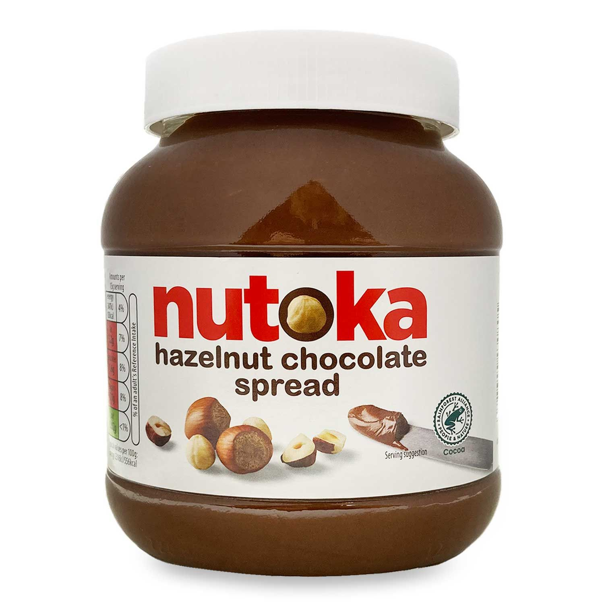

*“Can I copy your homework?”*

*“Yeah, just change it up a bit so it doesn’t look obvious you copied.”*

Aldi is well known for their shameless replica products, breaching the line of inspiration and copyright infringement. We all know the story of the now incarcerated [Cuthbert the Caterpillar](https://www.chroniclelive.co.uk/news/tv/aldi-cuthbert-caterpillar-christmas-advert-22144600), but it’s not just what’s in the box that steals its appearance from competitors. Here’s how their brands put typography to good use, grab your glasses to identify the differences in these near identical products.

 Here are two cheese flavoured corn puffs available in UK supermarkets. Both have the same dark blue background with orange text (the colour of which is meant to mimic the snack). Both use a bubble, curvy font to, again, look like curved cheese puffs. Wotsits came first, and the more natural colour gradient of the background (as opposed to the unblended contrasting blue of the Aldi Cheese Puffs) and the more refined use of image and graphics demonstrate this.

")

A bolder move from Aldi recently has been there new frozen fast food range by Snacksters. Their range includes the almost identical twin to McDonald's Big Mac: the Big Stack. Both are identified by a white box with a bold, sans serif font that fills up most of the blank space. Even the same colours are used; the same is true of the chicken nugget boxes. While many were waiting for a lawsuit to erupt after the products were revealed by Aldi earlier this year, McDonald's have let this one slip by so far.

Again, Aldi has mimicked the packaging and sans serif font of a well known food brand in order to sell their own product. The fun-to-say Nutoka is an almost exact copy, with the same red text and even similar imagery of the spread on a knife. The glass jar and white plastic are straight from the copier too.