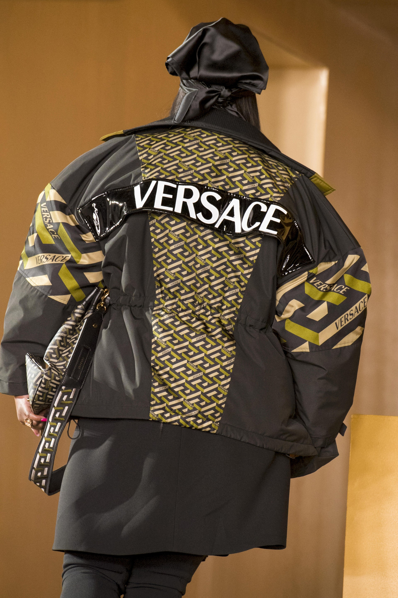
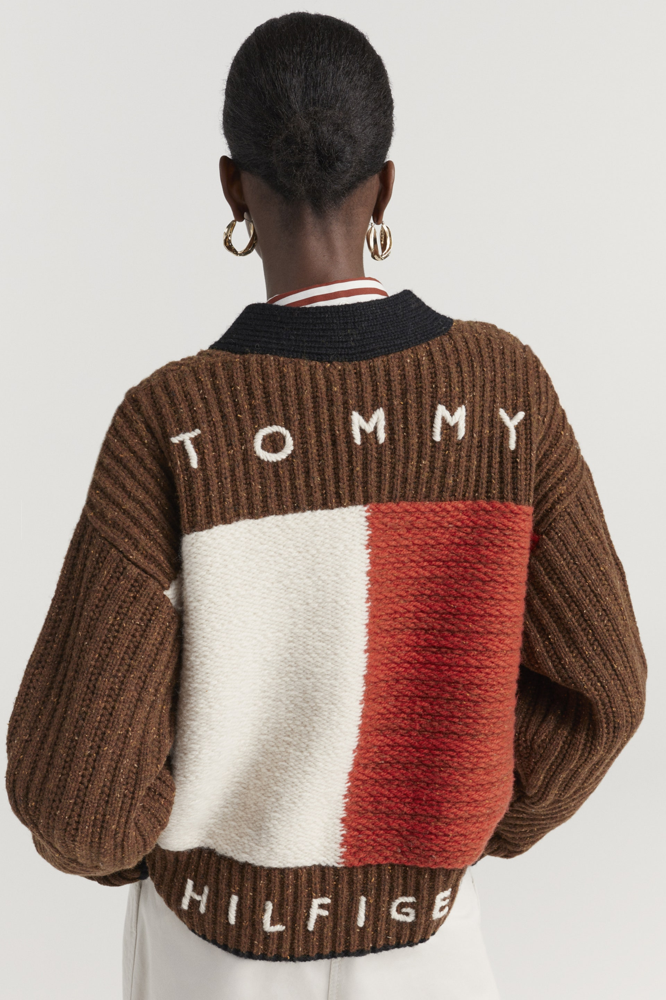
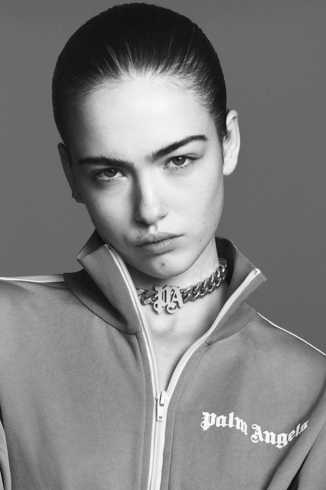
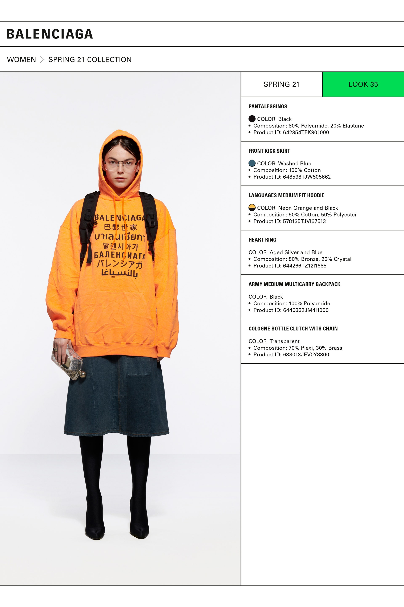

How do you make a plain white t-shirt cost £23? Put a name on it. Yes. That's it.

Suddenly a simple piece of fabric is elevated to a level of respect. Wearing Vans, a streetstyle footwear and apparel brand, gains respect among those in the know, as does any designer name plastered across your clothes. People will fork out hundreds of pounds on clothes simply because of the weight of the words sprawled across them. Why buy any old jumper when you can buy a Stone Island jumper? Why buy a nondescript handbag when you can have one with the Gucci *G* embroidered on it for £300 more? Even a plain pair of gym leggings suddenly becomes much more of an outfit with the Nike logo on it. How do these words hold so much power over the fashion industry?

It was in the 80s that brands and logos started to take on a larger than life role in fashion, and started an "affordable designer" trend that is still a staple in many wardrobes today, often based in Helvetica or Futura font variations. Brand names became more important, and showing you could afford them was the most important part of it all - what was the point of splashing £700 on a Prada bag if people didn't know it was Prada? Letting everyone know you buy from high end designers paints a high quality portrait of the wearer; a beautiful font scribbled across an otherwise boring t-shirt attracts eyes, but it's the name that attracts attention.

Of course, it's not just an external sense of pride that comes with buying the big names, but for many it's a sense of self satisfaction that comes with saving your money to spend on something special, and it would be impossible to forget that when the words are written in bold right in front of you. The shoes say 'Balenciaga' but read 'I worked hard, I earned this'.

Like every part of life, fashion has it's phases and roundabouts, and sometimes typography goes from chic to tacky. Every now and then, the line between 'I bought this at Selfridges' and 'I bought this at the tourist shop across the road from Selfridges' does blur, and it doesn't matter if it's a designer name or cheesy catchphrase written on your top: it's trashy. But at the moment, it's fair to say that typography is in and showing dedication to the brand is back. And bigger than ever.

