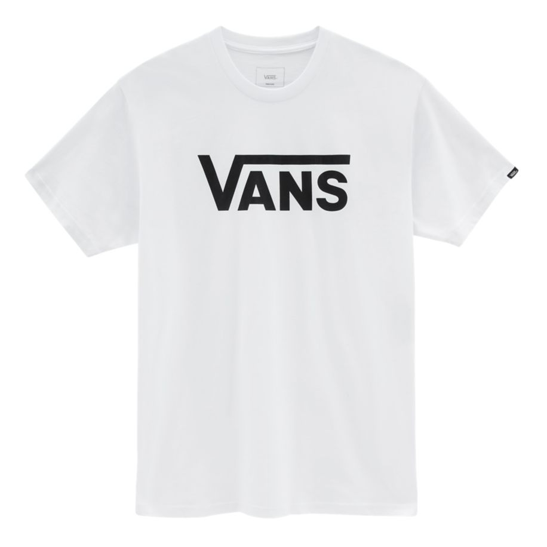

How do you make a plain white t-shirt cost £23? Put a name on it. Yes. That's it.

Suddenly a simple piece of fabric is elevated to a level of respect. Wearing Vans, a streetstyle footwear and apparel brand, gains respect among those in the know, as does any designer name plastered across your clothes. People will fork out hundreds of pounds on clothes simply because of the weight of the words sprawled across them. Why buy any old jumper when you can buy a Stone Island jumper? Why buy a nondescript handbag when you can have one with the Gucci *G* embroidered on it for £300 more? Even a plain pair of gym leggings suddenly becomes much more of an outfit with the Nike logo on it. How do these words hold so much power over the fashion industry?

It was in the 80s that brands and logos started to take on a larger than life role in fashion, and started an "affordable designer" trend that is still a staple in many wardrobes today. Brand names became more important, and showing you could afford them was the most important part of it all - what was the point of splashing £700 on a Prada bag if people didn't know it was Prada?