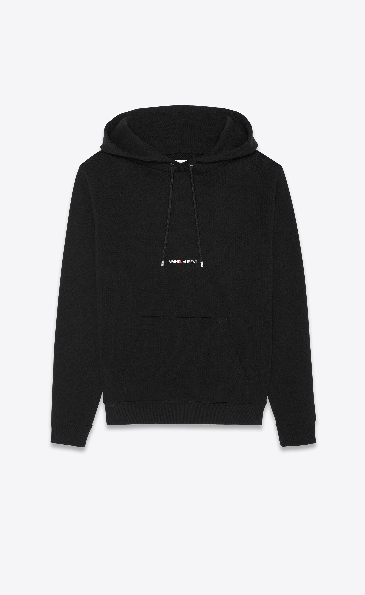

How do you make a plain white t-shirt cost £190? Put a name on it. Yes. That's it.

From basic to high fashion, suddenly a simple piece of clothing is taken from the streets to the catwalk. Why buy any old jumper when you can buy a Stone Island jumper? Why buy a nondescript handbag when you can have one with the Gucci G embroidered on it for £300 more? Even a plain pair of gym leggings suddenly becomes much more of an outfit with the Nike logo on it. How do these words hold so much power over the fashion industry? 

It was in the 80s that brands and logos started to take on a larger than life role in fashion, and started an "affordable designer" trend that is still a staple in many wardrobes today. The brands became more important than the clothes; it wasn't what you were wearing, but who. Seeing Moncler, or any other luxury brand written across your chest creates a bold visual statement, for both the designer and the wearer.

For the designer, it’s a way of defining themselves as more than just a company but a brand. It validates whether they can stand on nothing but their name; take away all the visuals and extras, and if people still buy it, that shows the brand’s power on the consumer market. There is, as well, the walking-talking advertisement aspect which definitely benefits the company. Clothing isn’t meant to advertise the same way a poster or billboard does, it targets its audience using its audience. A wealthy person in Versace sends a message about the brand, and influences others who want to look wealthy to buy Versace and maintain the image. And so the cycle continues. It helps as well that many of the top designers have been around for decades, everyone knows the Saint Laurent Helevtica or Louis Vuitton Futura font.

And for the wearer, the brands on your body define your lifestyle. It comes with a sense of pride being able to afford luxury brands. As brand names became more important, showing you could afford them was the most important part of it all - what is the point of splashing £700 on a Prada bag if people don’t know it’s Prada? A beautiful font scribbled across an otherwise boring t-shirt attracts eyes, but it's the name that attracts respect. In today’s consumer culture, the wearer and everyone around them knows that they have a higher state of fashion consciousness. It shows you think about what you are wearing, and you know what you (and the brands you wear) are worth. 

Of course, it's not just an external sense of pride that comes with buying the big names, but for many it's a sense of self satisfaction that comes with saving your money to spend on something special, and it would be impossible to forget that when the words are written in bold right in front of you. The shoes say 'Balenciaga' but read 'I worked hard, I earned this'.

It also establishes brand loyalty. You wouldn’t wear the word Champion if you didn’t believe in what the brand stood for. The thought that goes into the typography of these designs is really underestimate in creating this brand loyalty: if you wanted to appear ‘edgy’, you would search for a sans serif typeface, that appears more casual than serif but still holds respect; if you were looking for an ‘artsy’ look, the same designer will have another product with a curvier, bubble font. Both with the same brand name written across, but completely different styles, for different moods, and different events. If you can rely on one brand to show off your luxury style, you’ll be more likely to remain loyal to them and their name.

Whatever trends come and go, as long as high end fashion culture remains, so will brand typeface on clothes.

