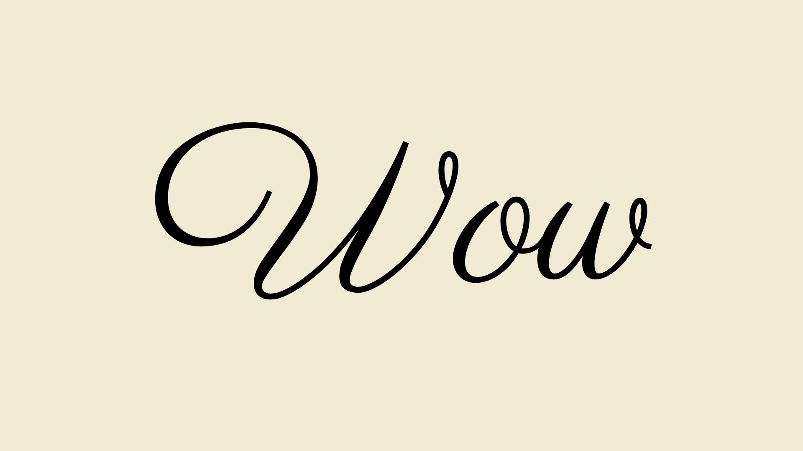

Manners maketh man. And so does the font, apparently.

Even in 2021, with most of society relinquishing gender stereotypes and embracing gender neutrality, many of us still are unable to shake the gender norms we've grown up with from our thoughts. Everyone knows the stereotype of blue being a boy colour and pink being for girls. And though we probably don't give it much thought in our day to day lives, the same is true for fonts.

If I say think of a feminine font, an idea of it pops in your head: slanted, loopy, ornamental typeface. And if I say think of a masculine font, you would most likely picture a thick, block, sans serif font. We see it daily in supermarkets, on restroom doors, on clothes and even on certain medicine packets.

I bet you read both if these in your head with different voices. The first typeface, a high contrast, flowing script font (named Parisienne - with an 'e' on the end just to emphasise its femininity) practically looks like a breathy sigh, a delicate sound from the tongues of angels. Whereas the second font may be read as a low grunt, the thick dark letters seem almost sarcastic with absolutely no other basis but their shape.

The shape of the stereotypical genders of typeface is, on deeper analysis, not random. Specifically in Western culture, women were supposed to be slim and soft, with sharp cheekbones and rounded hips. These contrasting yet complimentary features all correspond to create a stereotype of feminine typography that has no exact blueprint, yet still somehow all has feminine physical qualities. For example, Parisienne is nothing like the typeface Mrs Eaves (named after the mistress of British typeface designer John Baskerville); the latter is low quality with ornamental ligatures. Yet, both are stereotypically feminine in physicality. Type designer Tobias Frere-Jones wrote about once developing a logo for a company selling false nails, hair products and perfumes. He came to create a high contrast, sans serif font; when he went to compare his design to brands already on the shelves, he found many similar, female-targeted brands (Almay, Revlon, CoverGirl, L'Oréal and Maybelline to name a few) were using almost the exact same font. Everyone was rooted in Optima typeface which, again, isn't tangibly similar to Parisienne or Mrs Eaves, but still has historically feminine qualities.

Similarly, 'masculine' fonts tend to be broad and large, as Western society has, for decades, presented the correct image of masculinity to be. You can practically see the muscles bulging from the shoulders of certain typefaces on men's products. The 'UnnecessarilyGendered' Reddit thread has incredible examples of gendered typography and how it is used (as the title says, unnecessarily) to market to women and men. 

Type designer Marie Boulanger does a positive mindset for the future. In both the fashion industry and cosmetic sector, Boulanger writes in her book *XX, XY: Sex, Letters and Stereotypes* that she believes there’s a “subtle merging of codes” beginning in typefaces. She uses two gender neutral products and analyses their use of typography. Non Gender Specific applies a font with no gender stereotypes attached to it, and rids the products of "any typographic experimentation or fun". La Loba uses a typeface that is stereotypically masculine despite being aimed at everyone; “I thought that was way more interesting.” 

Overall, she hopes that people will alter their thoughts on what they consider to be feminine or masculine type. She says “It’s harmful not only because it uses stereotypes that nobody wants to hear about anymore but if we’re thinking about design and problem solving, it actively harms the resolution of those problems.

“If you want a typeface that is rounder and your internal bias is telling you that feminine means rounder, then I think it’s way more interesting to stop yourself and say, ‘What I really mean is rounder’,” Boulanger adds. “The world needs to hear ’rounder’ because that will help you define your design needs.”

We can only hope that with the rise of gender neutral products and marketing, there will be a cultural shift in what we perceive to be a feminine typeface or a masculine one.