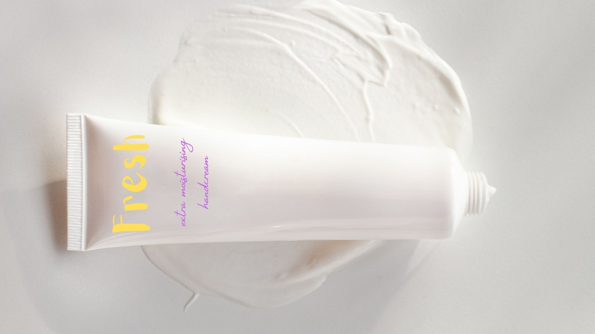

Twentieth Century typography scholar Beatrice Warde once said of typography “everything about it is calculated to reveal rather than to hide the beautiful thing which it was meant to contain.” When it comes to company design, this could not be more true. According to TheSerif.net, 72% of consumers say that packaging design influences their purchasing decisions (and they're just the ones that admit it).

The first thing many people see of a product is its logo. Then, depending on what they're buying, they might flip it over and read the label more carefully. If they're still interested, they could go look up the website and read more about the company. But all of this is dependent on one thing: good typography. If the words are too curved on the logo, or the colour of the fine print is illegible against its background, or the website text is too small, all of this could throw potential consumers from committing to your brand. It sounds silly investing loads of money into typeface design and copyrighting a certain font for your company, but it's easy to lookover just how important it is.

Between these two designs, which would you pick when creating a personal care brand? If your answer is the first one, please leave. The colours clash and have little connotation with cleanliness, the fonts similarly don't feel as hygienic and are far too difficult to read against the background. The second design, however, uses a clean, sans serif font that feels suitable for the product; likewise, the logo and the subtext use complementary shades of dark blue which, in branding, have connotations with skin care and sanitation.

In fact, the Nivea Boldface type, developed in 1992 for the skincare brand Nivea, has been credited by some typography experts as being directly linked to the company's profitability and its large market share in the worldwide skincare industry (to learn more, read Branding With Type by Rogener, Pool, and Packhauser, 1995). While no other skincare companies use the same font as Nivea, many will have similar typefaces, colour schemes, sizing and spacing in their design.

Type is so important even, it is even defensible at law. In 2003, premium cigarette brand Davidoff sued a company called Gofkid, which appears to have worked in metal goods, for the logo of their brand Durffee, which was strikingly similar. In the end, the exact copying of the font and positions of the letters 'D' and 'ff' won Davidoff the case. Durffee was found to be taking advantage of the high prestige appeal of a well known and established brand, and it was all through their typeface.

While it is important to know what is popular and what's not in the market a company is competing in, stealing a typeface outright is not the way to go about earning recognition. It is important for the typeface you use to reflect your individual and showcase what makes it better than the others around it, not just a carbon copy. Matthew Carter, one of the foremost typographical designers of the 20th Century, believes good typography should "provide a seamless passage of the author’s thoughts into the readers’ minds with as much sympathy, style, and congeniality as possible".

The typeface impacts a consumers experience with the brand. Ensuring an appropriate type for your product; whether you want it to look sporty, vintage, posh, romantic, delicious and more, the font has to suit that message. And this doesn't just apply to the logo. TheSerif.net also says that 75% of the consumers judge a business by its website design, meaning what looks good in the front, needs to be thought about all the way through to the back. The data company Nielsen states that web users have the topmost complaints about small font sizes and poor contrast while reading on the digital medium. A poor consumer experience reflects badly on the brand. If you're using an ornamental type for your logo to convey a vintage, high end message, don't use the same text in the paragraphs on your website: it will be too difficult to read and many will give up. Instead, opt for a slim, low contrast sans serif font that is legible yet still delicate. The same is true for any product aesthetic; you don't want to lose your brand when going from the product to the screen, but you also don't want to overwhelm your consumer with heavy typography and colour. 

Overall, typeface has a massive impact on every aspect of a brand's success, so it no longer seems so silly to be spending all that time and money on it.