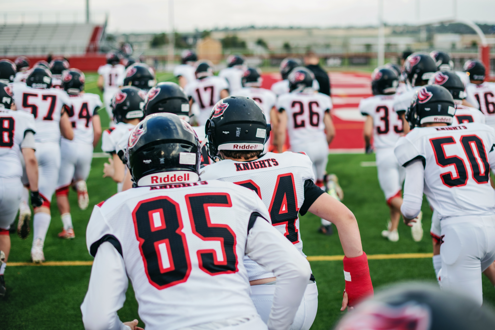
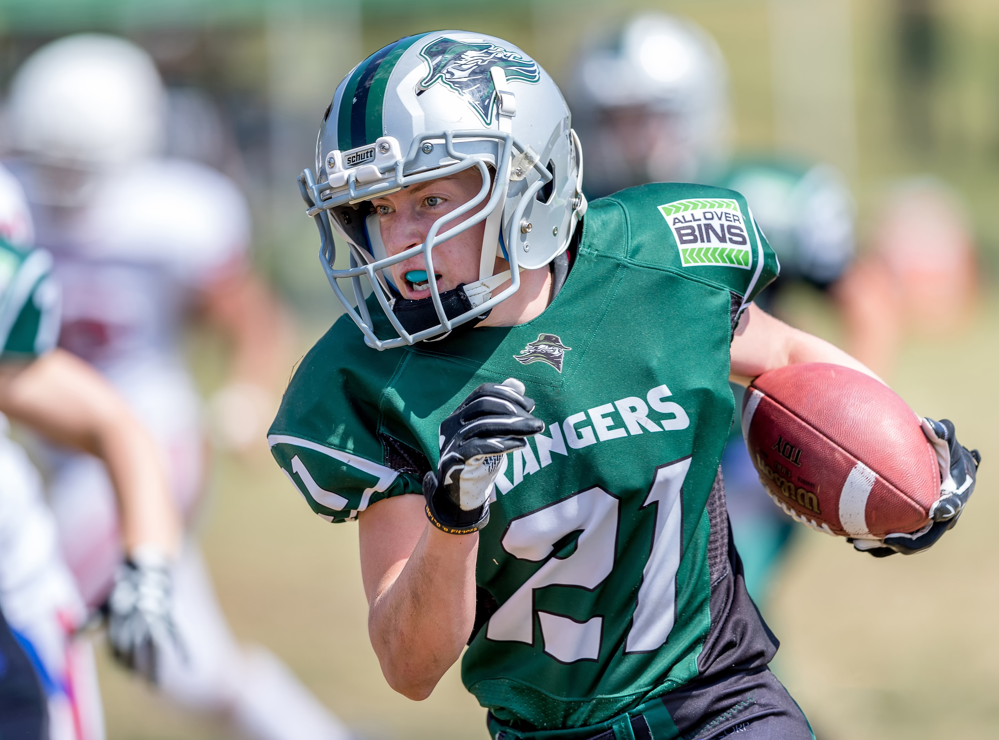
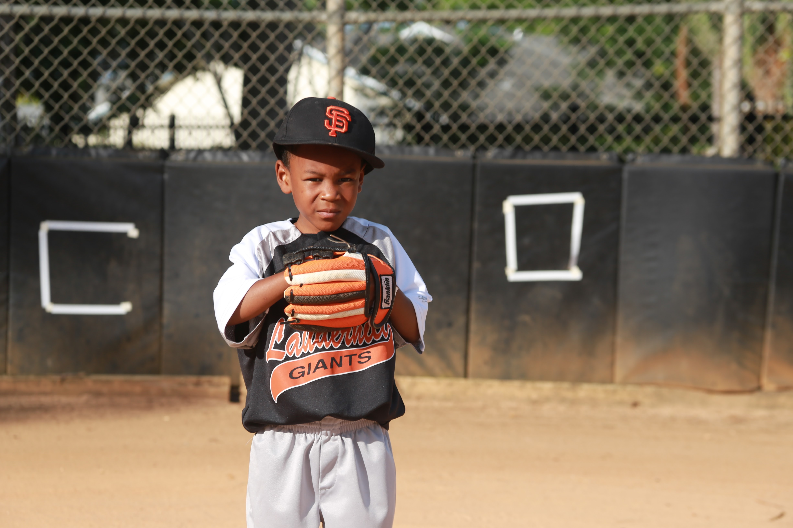

This page was started to take a look at the way typography is used today in branding, from credit cards to hoodies to chocolate bars. Typeface has a subtle influence on the way we read the letters in front of us - it can't be argued then that this affects the products we choose too. The whole image of a company is affected by the colour of their title, the slant of their letters, if there's a capital at the start or even an exclamation mark at the end. Typography is a make or break as to whether a company remains a company, or becomes a brand.

The design of this blog is influenced by the bold athletic lettering varisty and sports apparel. People underestimate the thought put into the typeface of a sports jersey. The constant shoving, jumping and running makes the fabric of the jersey twist; and if you're the coach, you're going to need to be able to see player number '7' distinctly from player number '1'. So, how do the designers overcome this? By going bold and going big. A thick outlined slab serif typeface will withstand the distortion of movement better than anything else.

I have reflected this power and clarity in my header, the large slab serif type stands prominent at the top of the page and the outline style is supposed to look like the stitching/patch fabric of the letters on a varsity jacket or sweatshirt. The colour scheme is inspired by a vintage varsity style sweathsirt of my own.

